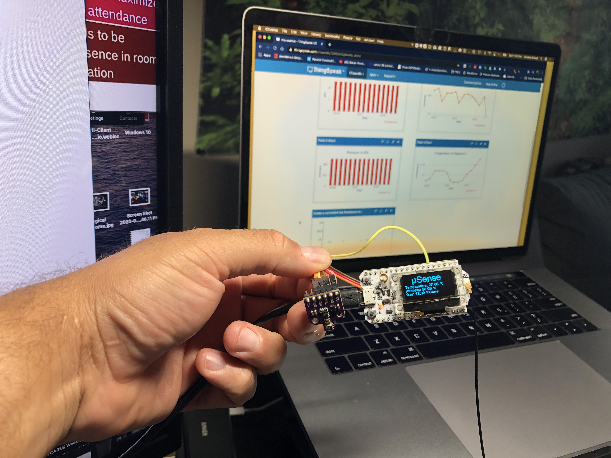
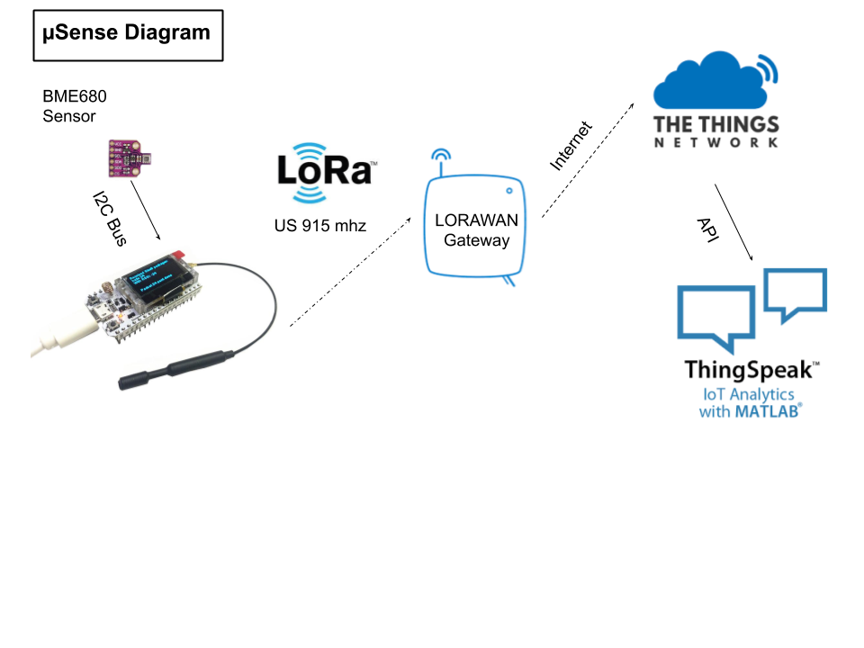

# µSense
Heltec Wifi LoRa 32 v2 with BME680 attached that collects data and sends it to The Things Network over LoRa.

| Device      | Fritzing      | 
|------------|-------------|
|  |  |

# Capsule Hackathon Project information (capsulehack.io)

The human senses provide methods to both observe and understand the world around you. Through the use of IoT technology and sensors, those observations can be collected and analyzed to develop data-based understanding of your world. µSense (pronounced micro-sense) will be a low-cost, opensource, open-data, and open-hardware device that will utilize the capabilities of a Lora enabled microcontroller device coupled with an atmospheric sensor to monitor the environmental conditions in a micro-climate. The platform will target temperature, relative humidity, pressure, and air quality initially using the BME680 sensor. The monitored location could range from an indoor room to an outside public space. The power of the device comes from the low barrier to entry nature of the project. It will allow interested persons to easily create and deploy devices in a DIY format.

## Project Roadmap
During the working hours of the Capsule Hackathon µSense team will accomplish three tasks.
1) Outline the scope and method of monitoring needed to produce a scientifically valuable data set for use in modeling expressed as possible educational modules.
2) The physical creation of a microcontroller utilizing Lora communications to transmit BME680 collected data while documenting the creation process.
3) Use of a centralized data collection platform with initial data visualizations.

 

## FAQ:
* What is the problem your project is trying to solve?

There are two problems µSense is attempting to resolve. The first is that of providing a method through which citizen science and education-based resources can meet in a way that connects participants to the environment generated information around them. Secondly, the data collected can serve the greater purpose of providing hyper-localized environmental data that can be utilized to improve weather and environmental models.

* How does your project contribute to solving this problem?

µSense is a platform that will provide micro-climate environmental data for the purpose of enabling students, teachers, scientists, and policymakers to have the information required for analysis to make data-driven decisions. The greater the number of devices, the greater resolution into targeted areas of concern the returned analysis and/or models become.

* What is the solution's relevance to current or emerging markets?

µSense both builds and applies skills in Environmental and Electronics Engineering, Programming, and Information Systems. When coupled with analysis and modeling the applied skill sets are extended into Applied Mathematics, Machine Learning, Informatics, and Statistics. The lost cost of components and use of the Lora infrastructure ensures the barrier to entry will be minimal. The practical skills gained through the creation and implementation of µSense will give the learner a valued upper hand in the job market thereby boosting the marketability of any participant in emerging markets.
